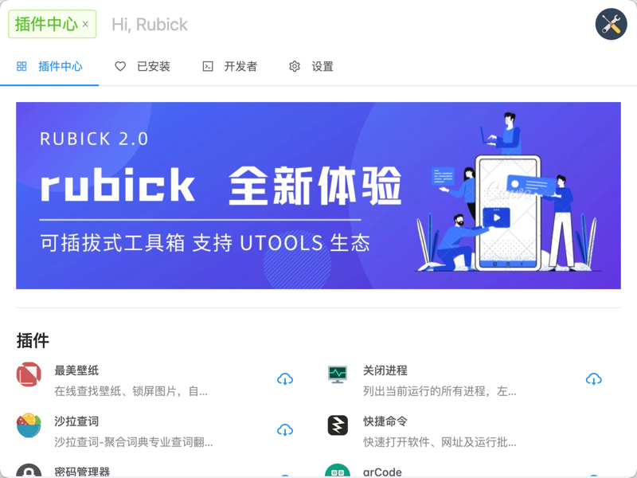
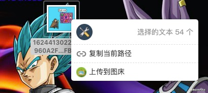
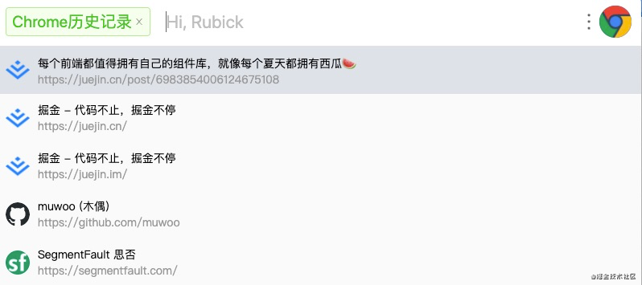
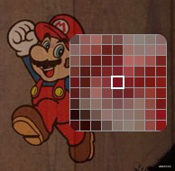
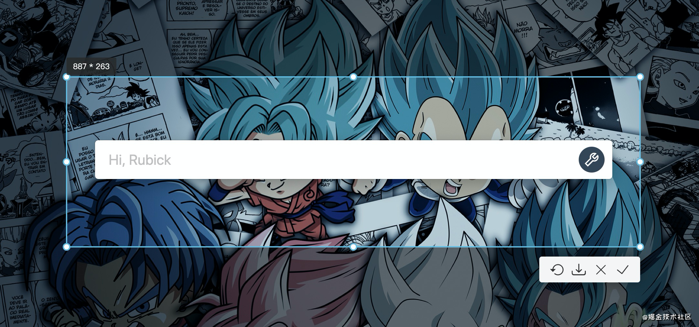
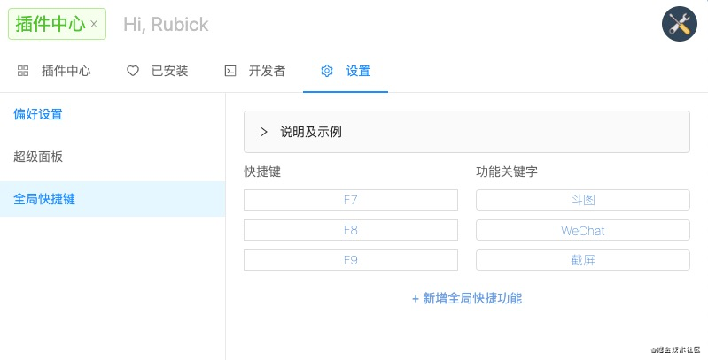

## 一、介绍
### 1.1 为什么需要 Rubick
之前在网上有看到很多小伙伴基于 `electron` 实现了非常多好用的桌面端工具，比如图床管理工具 [PicGo](https://picgo.github.io/PicGo-Doc/zh/guide/#%E4%B8%8B%E8%BD%BD%E5%AE%89%E8%A3%85) 就专门做图床工具。也有一些其他的类似的小工具，比如 [saladict-desktop](https://github.com/zenghongtu/saladict-desktop) 专门做沙拉翻译查词的桌面端应用，[colorpicker](https://github.com/Toinane/colorpicker) 专做桌面端取色工具...

我们也参考了这些小工具的设计理念，尝试在公司内部做一款桌面端工具，解决网络抓包、代理、图床、性能测评等常见场景的使用问题。最后在推广的时候，遇到了一个比较严重的问题，就是很多小工具对特定用户来说并不需要。比如测试只需要使用网络抓包、代理的功能，其他功能并不关心。此时就需要设计一款桌面端应用，类似于 `App Store` 那样，用到什么下载安装什么即可。这就需要实现桌面端应用的插件化。

于是乎，我们看到了 [uTools](https://u.tools/docs/guide/about-uTools.html) 是支持插件化的桌面端应用，
但是前提是我们的插件必须发布到 `uTools` 插件市场，才能实现多端同步下载的功能，但是公司内部的工具库有些涉及到安全信息又无法发布到 `uTools` 插件中，
所以我们特别渴望有一款类似于 `uTools` 的内部工具箱。既能使用 uTools 开源的插件，又能使用公司内部插件。

基于以上背景，诞生出了 Rubick。

项目地址：[https://github.com/clouDr-f2e/rubick](https://github.com/clouDr-f2e/rubick)


### 1.2 特点和优势

- 基于 electron，生态完善。
- 完全开源，可以从社区吸取营养，快速成长。
- 可使用 uTools 生态插件。

## 二、快速开始
### 2.1 安装
Rubick 是一款基于 Electron 的客户端工具，只需要根据自己的系统下载对应安装包即可，安装包地址：

* [Rubick Mac OS V0.0.2-beta.1](https://github.com/clouDr-f2e/rubick/releases/tag/v0.0.2-beta.1)
* [Rubick Windows V0.0.2-beta.1](https://github.com/clouDr-f2e/rubick/releases/download/v0.0.2-beta.1/rubick2.Setup.0.0.2-beta.1.exe)

### 2.2 本地开发
如果您需要本地化二次开发 `Rubick`，接下来介绍如何把本项目跑起来：
#### Macos
```bash
$ git clone git@github.com:clouDr-f2e/rubick.git
$ cd rubick
$ npm i
$ npm run rebuild
$ npm run dev
```
注意：因为项目依赖于 `robotjs` dev 环境运行请在 install 后执行 `npm run rebuild`。
其次，macos 也依赖 `iohook`，关于如何安装 `iohook` 可以参考：[iohook](https://wilix-team.github.io/iohook/installation.html)

#### Windows
目前 windows 还处于 alpha 版本，所以还没有合进 `master` 分支，需要切到 `feat-win` 分支进行项目启动：
```bash
$ git clone git@github.com:clouDr-f2e/rubick.git
$ cd rubick
$ npm i
$ npm run rebuild
$ npm run dev
```
windows 也依赖 `iohook` ，可以参考上面 `macos` 的安装方式安装 `iohook`。

### 核心功能介绍
#### 加载utools生态插件
目前我们自己部署了一台服务器，内置了一些系统插件，可以再插件中心中选择安装，安装完成后，直接在输入框内搜索关键词即可使用插件：




本地开发插件也非常简单， 拿 `github` 上开源的 斗图 插件举例，要加载斗图插件，只需要将代码 clone下来后，复制其 `plugin.json` 进入搜索框即可使用

斗图：https://github.com/vst93/doutu-uToolsPlugin


### 超级面板
长按鼠标右键，即可呼起超级面板，可以根据当前鼠标选择内容，匹配对应插件能力。比如当前选择图片后长按右击，则会呼起上传图床插件：



### 模板
为了更贴合 `uTools` 的插件能力，需要实现模板功能，模板即是一个内置 UI 样式的功能插件。




### utools 自带的系统命令
#### 取色
输入框内输入 `colorpicker` 或者 `取色` 关键词，呼起取色功能



#### 截屏
输入框内输入 `shortcut` 或者 `截屏` 关键词即可呼起截屏功能



#### 全局快捷键
可以配置全局快捷键，用于快速呼起或者打开对应功能或者 APP



## 三、总结
`Rubick` 开源的目的也是希望能够吸取一些社区优秀的想法和意见进来，帮助我们打造出更加易用的桌面端工具箱。所以如果您有任何意见非常欢迎给我们提 [建议](https://github.com/clouDr-f2e/rubick/issues) 。同时也非常欢迎您的`PR`，让我们一起打造出一款超优秀的桌面端工具箱！

## 四、参考资料
[rubick 官方文档](https://github.com/clouDr-f2e/rubick)


