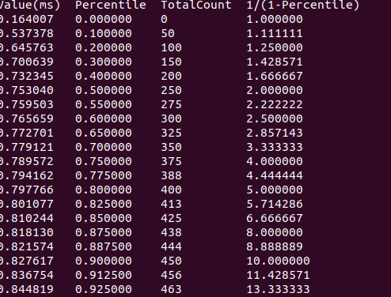
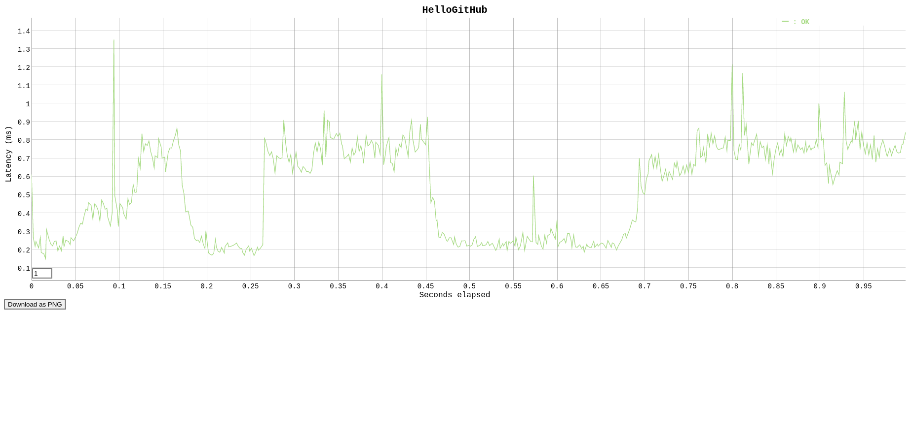

# 你的小破站抗压么？推荐一款超级方便的开源压测工具


这里是 HelloGitHub 推出的[《讲解开源项目》](https://github.com/HelloGitHub-Team/Article)系列，本期介绍一款标星 17.7k 纯 Go 语言实现的 HTTP(S) 压测工具——**vegeta**

> 项目地址：https://github.com/tsenart/vegeta

**Vegeta** 是一款用 Go 语言编写的多功能 HTTP(S) 压测工具：安装方便、功能齐全、使用简单，还可作为命令行工具或者开发库进行使用。它不仅提供了常见的压测功能，还支持格式化结果并输出为图表或动态显示当前结果。



通过本文你将掌握这款强大压测工具的基本用法，让压测只需一条命令！

## 一、 安装

从仓库下载编译好的二进制文件：

> https://github.com/tsenart/vegeta/releases

PC 上下载 amd64 版本即可，在 Mac Os X 上使用 Homebrew 安装：

```shell
$ brew update && brew install vegeta
```

如果你会 Go 语言，使用 `get` 自动安装：

```shell
$ go get -u github.com/tsenart/vegeta
```

> 如提示找不到指令，请确保 go 以及 GOBIN 在您的环境变量中

## 二、快速入门

> 以下指令均可以在 Linux 下运行

对于下载编译好的用户建议先将 vegeta 临时添加到 PATH 路径，方便使用：

```shell
$ cd vegeta
$ export PATH=$pwd:$PATH
```

或者直接将 vegeta 放到 bin 目录下：

```shell
$ cd vegeta
$ sudo mv vegeta /usr/local/bin/
```

输入 `vegeta -version` 后可以显示证明安装成功。

首次使用可以使用：

```shell
$ vegeta --help
```

来查看支持的指令和相关例子。

### 1. 使用例子

在命令行输入：

```shell
$ echo "GET http://127.0.0.1:233"| vegeta attack -rate=500 -connections=1 -duration=1s | tee results.bin | vegeta report
```

将会得到如图所示的结果：


这条指令前半部分的 `echo "GET http://127.0.0.1:233"` 表示想要测试的地址，这里我使用的是 nginx 搭建的本地服务器，`vegeta attack` 代表测试指令，其后 `-rate` `-connections` `-duration` 分别表示每秒钟请求次数、每个地址最大连接数、持续时间。

攻击完成后使用 `tee results.bin` 保存测试报告并用 `veteta report` 显示报告内容。

`vegeta report` 也支持使用 文本、JSON、直方图、hdrplot 等：

```shell
$ echo "GET http://127.0.0.1:233"| vegeta attack -rate=500 -connections=1 -duration=5s > results.bin
```

**文本**（默认情况）

```shell
$ vegeta report results.bin
```


**直方图**

```shell
$ vegeta report -type='hist[0,1ms,2ms,3ms,4ms]' results.bin
```


**JSON**

```shell
$ vegeta report --type json results.bin
```


**hdrplot**

```shell
$ vegeta report --type hdrplot results.bin
```



### 2.生成图形

接`上一小节`的内容，我们将文字形式的报告转为图表显示，在命令行中输入：

```shell
$ vegeta plot --title HelloGitHub results.bin > plot.html
```

在浏览器中打开新生成的 `plot.html`，即可看到图形化的测试数据：



其中 `--title HelloGitHub` 用来设置表头文字。此外还有

`-cpu` 用来设置默认使用的 cpu 核心数量，这里我默认是 12。可以使用 `--threshold` flag 设定下采样阈值。

> vegeta plot 也可以将多个曲线放在一起，使用 vegeta plot result_1.bin result2_.bin ... result_n.bin > plot.html 即可

此外，配合 Go 下的 `jaggr` 和 `jplot` 可以实现动态画面输出，官方给出的指令和效果如下：

```shell
$ echo 'GET http://localhost:8080' | \
    vegeta attack -rate 5000 -duration 10m | vegeta encode | \
    jaggr @count=rps \
          hist\[100,200,300,400,500\]:code \
          p25,p50,p95:latency \
          sum:bytes_in \
          sum:bytes_out | \
    jplot rps+code.hist.100+code.hist.200+code.hist.300+code.hist.400+code.hist.500 \
          latency.p95+latency.p50+latency.p25 \
          bytes_in.sum+bytes_out.sum
```


> 由于 jplot 需要 iTerm2 但笔者没有苹果系列的电脑所以关于动态输出部分的内容大家需要自己研究。

### 3.使用管道

如果您了解 Shell 的管道那就不难看出，前文代码中就是使用管道将 `echo "GET http:// xxx"` 的输出内容传给了 `vegeta`。通过管道，除了使用简单的 `echo` 工具，也可以使用其他任何程序的输出作为测试目标。

### 4.转换编码

vegeta 同样提供了编码转换功能，现在支持三种编码格式：Gob （二进制）、CSV 以及 JSON（默认） 使用 `veget encode`  可以做到这几种编码的相互转换：

```shell
$ echo "GET http://127.0.0.1:233"| vegeta attack -rate=500 -connections=1 -duration=1s > results.gob
$ cat results.gob | vegeta encode | jq .
```

可以显示转换为 JSON 格式的测试信息，或者：

```shell
$ cat results.gob | vegeta encode --to csv --output results.csv
```

> 输入格式的检测是自动完成的，不需要手动进行设置。

## 三、结语

到这里 vegeta 的基本使用到这里就结束了，它还支持一些精细参数的设置比如证书、密钥等，但限于篇幅和笔者知识水平限制无法扩展太多，大家可以根据需要的使用 `vegeta [command] --help` 指令进行查看，也可以阅读官方的[使用手册](https://github.com/tsenart/vegeta#usage-manual)


> 项目地址：https://github.com/tsenart/vegeta

温馨提示：压测虽好玩但不要贪杯哦，别压起劲儿来把线上服务给压挂了！